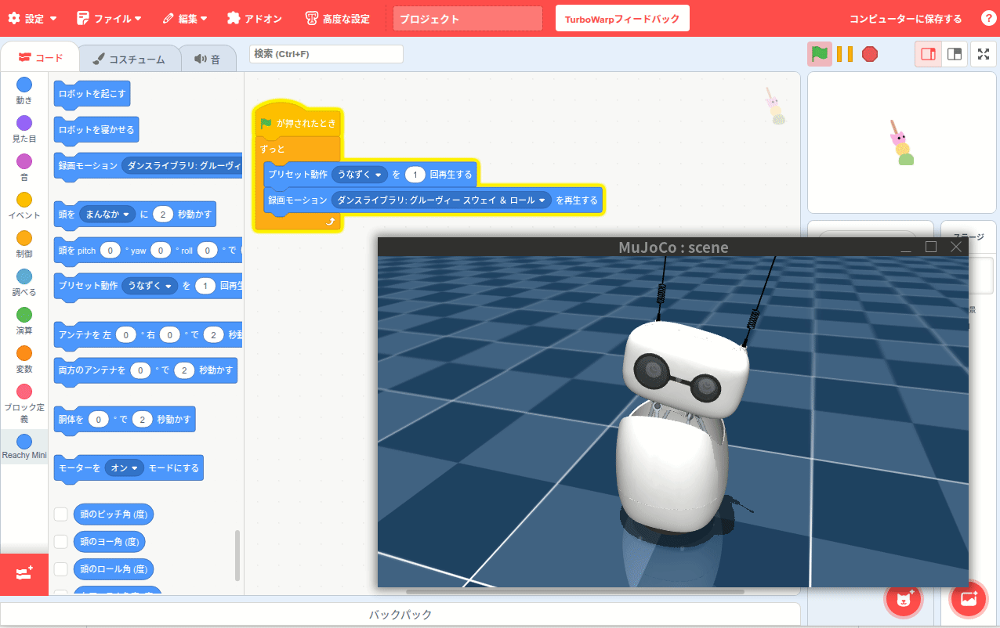

# Reachy Mini TurboWarp Extension



Custom TurboWarp/Scratch 3.0 extension for controlling the Reachy Mini robot.

## Prerequisites

- **[TurboWarp Desktop](https://desktop.turbowarp.org/)** (or the web editor) installed.
- **[Reachy Mini SDK](https://github.com/pollen-robotics/reachy_mini)** checked out on your machine.
- The `reachy-mini-daemon` process running (real robot, wireless version, or simulator mode).  
  The extension communicates with the daemon at `http://localhost:8000/api/`, so ensure the daemon is reachable before loading the extension.

## Usage

1. Build artifacts are published automatically via GitHub Actions and exposed through jsDelivr.

   **Latest version (from gh-pages):**
   ```
   https://cdn.jsdelivr.net/gh/iizukak/reachy_mini_turbowarp@gh-pages/extension.js
   ```

   **Specific version (recommended for production):**
   ```
   TBD
   ```

   **Note:** jsDelivr may cache files for up to 24 hours. If you need the absolute latest build immediately, download `extension.js` directly from the [gh-pages branch](https://github.com/iizukak/reachy_mini_turbowarp/tree/gh-pages) and load it as a local file in TurboWarp.

2. In TurboWarp:
   - Open the Extensions menu → "Custom Extension".
   - Paste one of the jsDelivr URLs above.
   - The **Reachy Mini** blocks will appear; confirm the daemon is running to execute the blocks.

## Supported Blocks

| Block (EN) | Type | Description |
| --- | --- | --- |
| `wake up robot` | Command | Plays the built-in wake animation and waits for it to finish. |
| `put robot to sleep` | Command | Runs the shutdown animation to park the robot safely. |
| `play recorded move [MOVE]` | Command | Requests a recorded move from the selected dataset via the daemon. |
| `move head [DIRECTION] for [DURATION] seconds` | Command | Moves the head to one of the eight presets (center/up/down/left/right + diagonals). |
| `move head pitch [PITCH]° yaw [YAW]° roll [ROLL]° for [DURATION]s` | Command | Sends custom angles (degrees input → radians) directly to `/move/goto`. |
| `run preset motion [MOTION] [CYCLES] times` | Command | Plays predefined motion scripts (nod, shake, antenna wave, body sway). |
| `move antennas left [LEFT]° right [RIGHT]° for [DURATION]s` | Command | Independently positions each antenna joint. |
| `move both antennas [ANGLE]° for [DURATION]s` | Command | Moves both antennas symmetrically. |
| `move body yaw [ANGLE]° for [DURATION]s` | Command | Rotates the torso around the yaw axis. |
| `set motor mode [MODE]` | Command | Switches motor control to enabled / disabled / gravity compensation. |
| `head pitch (degrees)` | Reporter | Returns the latest cached pitch value converted to degrees. |
| `head yaw (degrees)` | Reporter | Returns the yaw angle in degrees. |
| `head roll (degrees)` | Reporter | Returns the roll angle in degrees. |
| `left antenna angle (degrees)` | Reporter | Reads the left antenna joint position. |
| `right antenna angle (degrees)` | Reporter | Reads the right antenna joint position. |
| `body yaw (degrees)` | Reporter | Reports the torso yaw angle. |
| `motor mode` | Reporter | Indicates the daemon-reported motor mode. |
| `daemon connected?` | Boolean | Pings `/daemon/status` to confirm connectivity. |

## Developer Guide

Install dependencies once:

```bash
npm install
```

Available npm scripts:

| Command | Description |
| --- | --- |
| `npm run lint` | Run ESLint and formatting checks. |
| `npm run test:unit` | Execute unit tests (no daemon required). |
| `npm run test:integration` | Runs against a live/simulated Reachy Mini daemon (ensure `reachy-mini-daemon` is running). |
| `npm run build` | Compile the TypeScript sources into `dist/extension.js`. |
| `npm run preview` | Serve the production bundle locally via Vite (`http://localhost:3000/extension.js`). |

CI (GitHub Actions) runs lint, unit tests, integration tests, and a deploy job that pushes `dist/` to the `gh-pages` branch, enabling the jsDelivr delivery described above.

## Known Limitations

- **Languages**: Only English (`en`) and Japanese (`ja`) strings are currently provided.
- **Locale detection**: The extension switches language based on the host OS locale, not TurboWarp’s UI language preference.
- **Hardware validation**: Real-hardware test coverage is limited; most scenarios have only been exercised in the simulator.
- **Wireless edition**: The wireless Reachy Mini has not been tested; quick smoke tests were done solely on the Lite version.
