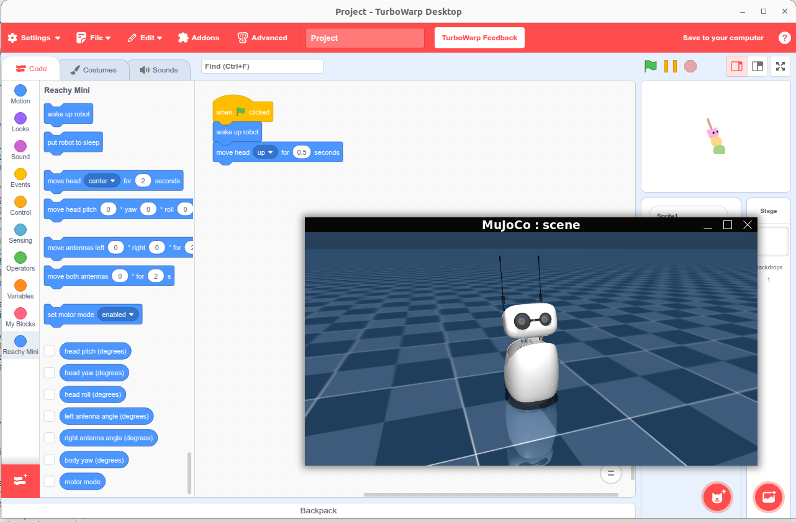

# Reachy Mini TurboWarp Extension



Custom TurboWarp/Scratch 3.0 extension for controlling the Reachy Mini robot.

## Prerequisites

- **[TurboWarp Desktop](https://desktop.turbowarp.org/)** (or the web editor) installed.
- **[Reachy Mini SDK](https://github.com/pollen-robotics/reachy_mini)** checked out on your machine.
- The `reachy-mini-daemon` process running (real robot, wireless version, or simulator mode).  
  The extension communicates with the daemon at `http://localhost:8000/api/`, so ensure the daemon is reachable before loading the extension.

## Usage

1. Build artifacts are published automatically to GitHub Pages and exposed through jsDelivr.  
   Latest bundle:  
   `https://cdn.jsdelivr.net/gh/iizukak/reachy_mini_turbowarp@gh-pages/extension.js`
2. In TurboWarp:
   - Open the Extensions menu → “Custom Extension”.
   - Paste the jsDelivr URL above.
   - The `reachy_mini_turbowarp` blocks will appear; confirm the daemon is running to execute the blocks.

## Developer Guide

Install dependencies once:

```bash
npm install
```

Available npm scripts:

| Command | Description |
| --- | --- |
| `npm run lint` | Run ESLint and formatting checks. |
| `npm run test:unit` | Execute unit tests (no daemon required). |
| `npm run test:integration` | Runs against a live/simulated Reachy Mini daemon (ensure `reachy-mini-daemon` is running). |
| `npm run build` | Compile the TypeScript sources into `dist/extension.js`. |
| `npm run preview` | Serve the production bundle locally via Vite (`http://localhost:3000/extension.js`). |

CI (GitHub Actions) runs lint, unit tests, integration tests, and a deploy job that pushes `dist/` to the `gh-pages` branch, enabling the jsDelivr delivery described above.

## Known Limitations

- **Languages**: Only English (`en`) and Japanese (`ja`) strings are currently provided.
- **Locale detection**: The extension switches language based on the host OS locale, not TurboWarp’s UI language preference.
- **Hardware validation**: Real-hardware test coverage is limited; most scenarios have only been exercised in the simulator.
- **Wireless edition**: The wireless Reachy Mini has not been tested; quick smoke tests were done solely on the Lite version.
